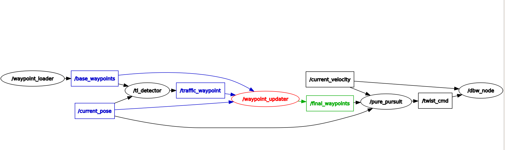
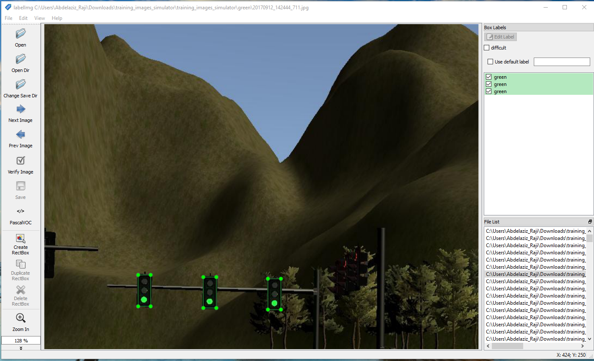
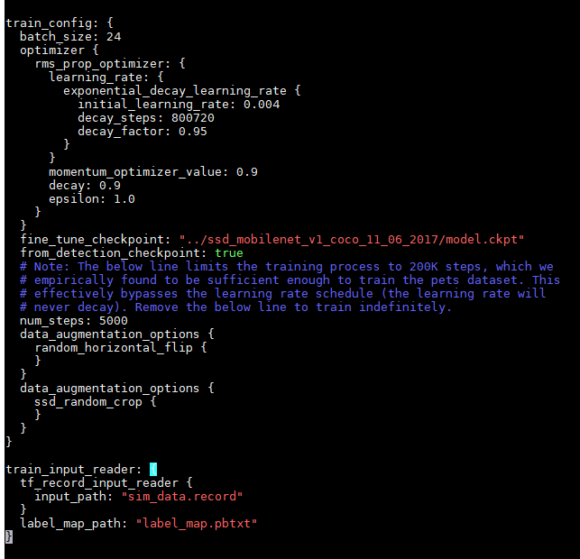
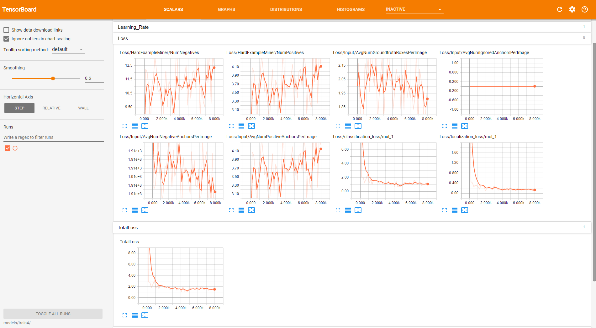
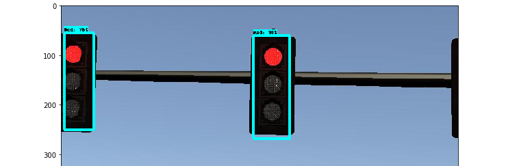
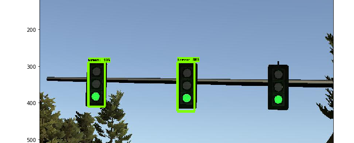
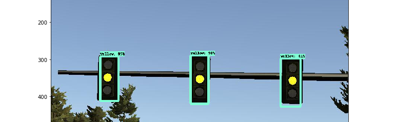

# Self Driving Car Capstone Project - System Integration

[](http://www.udacity.com/drive)

Overview
---
The goals of this project are to create ROS nodes to implement core functionality of the autonomous vehicle system, including traffic light detection, control, and waypoint following. Once all the ROS nodes are up & working seamlessly integration code will be tested on a real-life autonomous vehichle, named Carla followed by simlator locally.


[Capstone Video](https://www.youtube.com/watch?v=Xc5Ln870Vww)

## Team Members
The members of team **Mater**: [](http)

| Name | Udacity handle | Email |
| --- | --- | --- |
|Abdelaziz R.|Abdelaziz R.|aabdelaziz.raji@gmail.com|
|Askari Hasan | Hasan Askari|hasan_askari79@yahoo.com |
|Dae Robert |Robert Dämbkes |robertrd@gmx.de|
|**Neranjaka J.(*)**|**Neranjaka Jayarathne** |**neranjake@gmail.com**|
|Prabhakar Rana| Prabhakar R| prabhakar.rana@gmail.com|
| | | |

**(*) Team Lead**

## System Architecture Diagram :

The following is a system architecture diagram showing the ROS nodes and topics used in the project. 


Here same architecture displayed using ROS graphing tool :




## Code Structure :

### 1 - Waypoint Update:

Code location : ros/src/waypoint_updater/

This package contains the waypoint updater node: waypoint_updater.py. The purpose of this node is to update the target velocity property of each waypoint based on traffic light and obstacle detection data. This node will subscribe to the /base_waypoints, /current_pose, /obstacle_waypoint, and /traffic_waypoint topics, and publish a list of waypoints ahead of the car with target velocities to the /final_waypoints topic.


### 2 - Twist Controller:

Carla is equipped with a drive-by-wire (DBW) system, meaning the throttle, brake, and steering have electronic control. This package contains the files that are responsible for control of the vehicle: the node dbw_node.py and the file twist_controller.py.


### 3 - Traffic Light Detection:

This package contains the traffic light detection node: tl_detector.py. This node takes in data from the /image_color, /current_pose, and /base_waypoints topics and publishes the locations to stop for red traffic lights to the /traffic_waypoint topic.

The /current_pose topic provides the vehicle's current position, and /base_waypoints provides a complete list of waypoints the car will be following.

We build both a traffic light detection node and a traffic light classification node. Traffic light detection should take place within tl_detector.py, whereas traffic light classification should take place within ../tl_detector/light_classification_model/tl_classfier.py.


## Simulator :

The team has leveraged the [Tensorflow detection model zoo](https://github.com/tensorflow/models/blob/master/research/object_detection/g3doc/detection_model_zoo.md), to train a model for traffic light classification and use it inside tl_classify.py .
  
### Steps
#### Dataset :

we leveraged two existing dataset (Thanks [Alex](https://github.com/alex-lechner/Traffic-Light-Classification) and [Vatsal](https://github.com/coldKnight/TrafficLight_Detection-TensorFlowAPI) ) but also added couple of images saved from simulator.
The images saved were labelled using labeImg :



 Final Dataset :
 ```bash
        - Training :  917
        - Testing :   277
 ```     
#### Setup training environment :
See very detailed steps [here](https://github.com/alex-lechner/Traffic-Light-Classification)) then convert images and annotations to tensorflow record format. 
```sh
(araji) abdelaziz_raji@carnd:~/workarea/tensorflow/models/research/capstone$ python convert.py --output_path sim_data.record
```

#### Transfert learning :
    
Team has imported pretrained model [ssd_mobilnet](http://download.tensorflow.org/models/object_detection/ssd_mobilenet_v1_coco_2017_11_17.tar.gz) and expand the tarball and customize the config file to match your environment and dataset:


    
#### Training/monitoring and exporting resulting graph:
    
##### start training :
```sh
python train.py -logtostderr --train_dir=./models/train --pipeline_config_path=config/ssd_mobilenet_sim.config
```

##### start monitoring with tensorboard:
```sh
tensorboard --logdir models/train4/ --host 10.142.0.13
TensorBoard 0.4.0 at http://10.142.0.13:6006 (Press CTRL+C to quit)
```

Tensorboard snapshot during training :


    
To export graph ( freeze):
```sh
python export_inference_graph.py --input_type image_tensor --pipeline_config_path ./config/ssd_mobilenet_sim.config --       trained_checkpoint_prefix ./models/train/model.ckpt-2000 --output_directory ./fine_tuned_model
```

##### Notebook validation:
Using the udacity provided notebook but modified to load our own inference model , we tested a couple of images :


    



## Site Training

 Site training followed a similar process but faster rcnn network model was selected and trained with around 350 images.
  
 
## References used :
* https://becominghuman.ai/traffic-light-detection-tensorflow-api-c75fdbadac62
* https://github.com/alex-lechner/Traffic-Light-Classification
* https://github.com/EdjeElectronics/TensorFlow-Object-Detection-API-Tutorial-Train-Multiple-Objects-Windows-10

---
Original README:
---

###
This is the project repo for the final project of the Udacity Self-Driving Car Nanodegree: Programming a Real Self-Driving Car. For more information about the project, see the project introduction [here](https://classroom.udacity.com/nanodegrees/nd013/parts/6047fe34-d93c-4f50-8336-b70ef10cb4b2/modules/e1a23b06-329a-4684-a717-ad476f0d8dff/lessons/462c933d-9f24-42d3-8bdc-a08a5fc866e4/concepts/5ab4b122-83e6-436d-850f-9f4d26627fd9).

Please use **one** of the two installation options, either native **or** docker installation.

### Native Installation

* Be sure that your workstation is running Ubuntu 16.04 Xenial Xerus or Ubuntu 14.04 Trusty Tahir. [Ubuntu downloads can be found here](https://www.ubuntu.com/download/desktop).
* If using a Virtual Machine to install Ubuntu, use the following configuration as minimum:
  * 2 CPU
  * 2 GB system memory
  * 25 GB of free hard drive space

  The Udacity provided virtual machine has ROS and Dataspeed DBW already installed, so you can skip the next two steps if you are using this.

* Follow these instructions to install ROS
  * [ROS Kinetic](http://wiki.ros.org/kinetic/Installation/Ubuntu) if you have Ubuntu 16.04.
  * [ROS Indigo](http://wiki.ros.org/indigo/Installation/Ubuntu) if you have Ubuntu 14.04.
* [Dataspeed DBW](https://bitbucket.org/DataspeedInc/dbw_mkz_ros)
  * Use this option to install the SDK on a workstation that already has ROS installed: [One Line SDK Install (binary)](https://bitbucket.org/DataspeedInc/dbw_mkz_ros/src/81e63fcc335d7b64139d7482017d6a97b405e250/ROS_SETUP.md?fileviewer=file-view-default)
* Download the [Udacity Simulator](https://github.com/udacity/CarND-Capstone/releases).

### Docker Installation
[Install Docker](https://docs.docker.com/engine/installation/)

Build the docker container
```bash
docker build . -t capstone
```

Run the docker file
```bash
docker run -p 4567:4567 -v $PWD:/capstone -v /tmp/log:/root/.ros/ --rm -it capstone
```

### Port Forwarding
To set up port forwarding, please refer to the "uWebSocketIO Starter Guide" found in the classroom (see Extended Kalman Filter Project lesson).

### Usage

1. Clone the project repository
```bash
git clone https://github.com/udacity/CarND-Capstone.git
```

2. Install python dependencies
```bash
cd CarND-Capstone
pip install -r requirements.txt
```
3. Make and run styx
```bash
cd ros
catkin_make
source devel/setup.sh
roslaunch launch/styx.launch
```
4. Run the simulator

### Real world testing
1. Download [training bag](https://s3-us-west-1.amazonaws.com/udacity-selfdrivingcar/traffic_light_bag_file.zip) that was recorded on the Udacity self-driving car.
2. Unzip the file
```bash
unzip traffic_light_bag_file.zip
```
3. Play the bag file
```bash
rosbag play -l traffic_light_bag_file/traffic_light_training.bag
```
4. Launch your project in site mode
```bash
cd CarND-Capstone/ros
roslaunch launch/site.launch
```
5. Confirm that traffic light detection works on real life images

### Other library/driver information
Outside of `requirements.txt`, here is information on other driver/library versions used in the simulator and Carla:

Specific to these libraries, the simulator grader and Carla use the following:

|        | Simulator | Carla  |
| :-----------: |:-------------:| :-----:|
| Nvidia driver | 384.130 | 384.130 |
| CUDA | 8.0.61 | 8.0.61 |
| cuDNN | 6.0.21 | 6.0.21 |
| TensorRT | N/A | N/A |
| OpenCV | 3.2.0-dev | 2.4.8 |
| OpenMP | N/A | N/A |

We are working on a fix to line up the OpenCV versions between the two.
